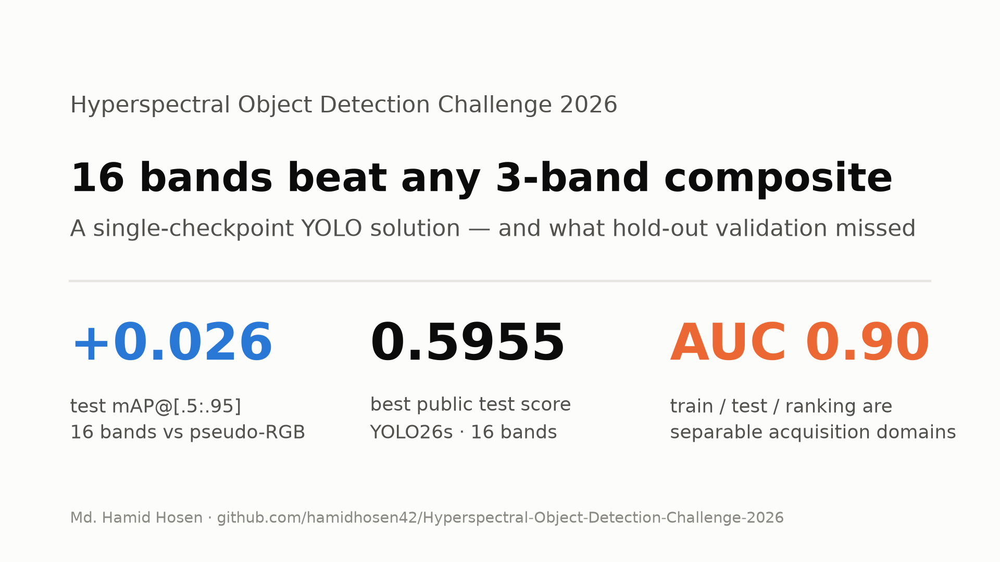
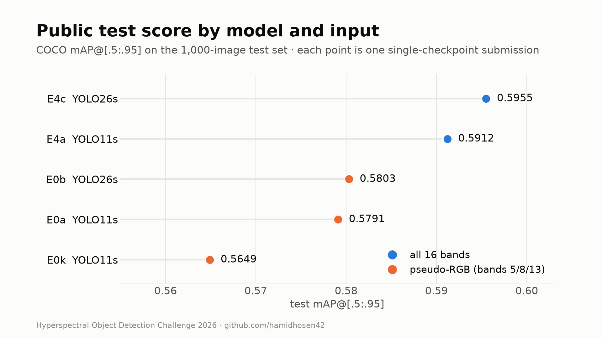
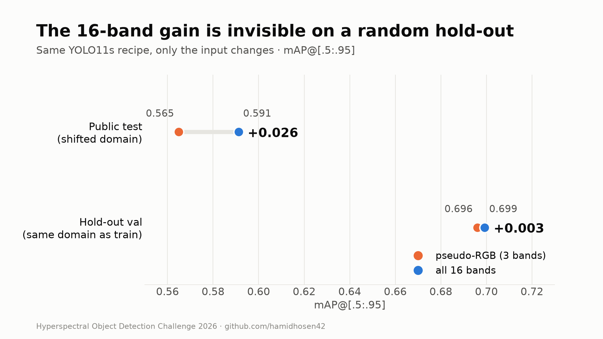
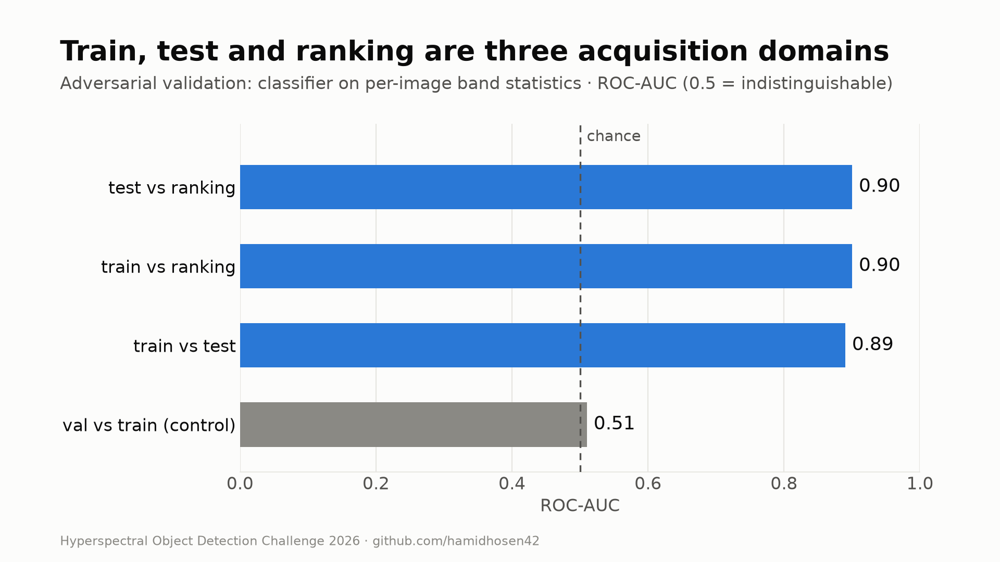
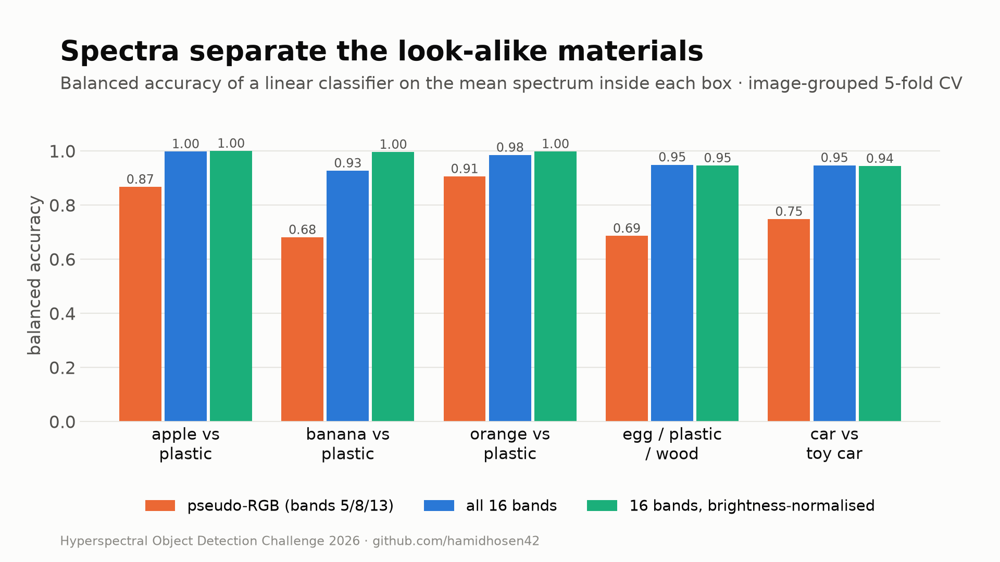
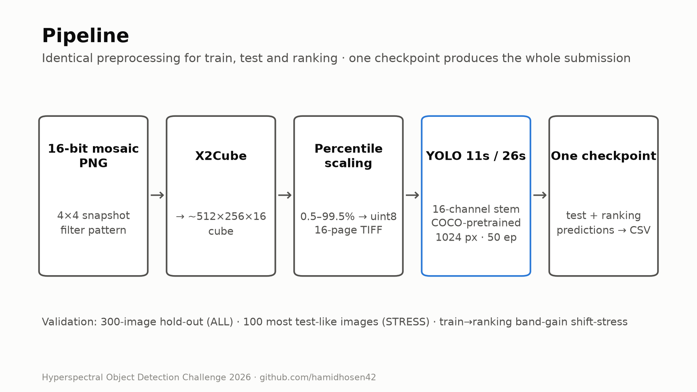

<div align="center">

# Hyperspectral Object Detection Challenge 2026

**Single-checkpoint YOLO detectors on 16-band snapshot hyperspectral imagery**

[](https://www.kaggle.com/competitions/hyperspectral-object-detection-challenge-2026)
[](https://www.python.org/)
[](https://pytorch.org/)
[](https://github.com/ultralytics/ultralytics)
[](LICENSE)

</div>



This repository holds my end-to-end solution for Track 1 of the *2nd Hyperspectral Remote Sensing Data Processing and Application Challenge*, hosted on Kaggle. The task is to detect and classify 18 object categories, including look-alike pairs such as real versus plastic fruit, in 16-band visible-light hyperspectral images.

The repo covers:
- dataset forensics
- a leakage-aware validation protocol with stress tests
- a reproducible Kaggle-GPU experiment pipeline
- a rule-compliant single-model submission builder

---

## Contents

- [Competition at a glance](#competition-at-a-glance)
- [Results](#results)
- [Key findings](#key-findings)
- [Method](#method)
- [Validation protocol](#validation-protocol)
- [Repository structure](#repository-structure)
- [Quick start](#quick-start)
- [Rule compliance](#rule-compliance)
- [Lessons learned](#lessons-learned)
- [References](#references)
- [Citation](#citation)
- [License](#license)

---

## Competition at a glance

| | |
|---|---|
| **Sensor** | XIMEA snapshot mosaic camera, 4×4 filter pattern → **16 bands, ~460–600 nm** |
| **Input** | 16-bit greyscale mosaic PNG, demosaiced with `X2Cube` to a cube of about 512×256×16 |
| **Labels** | Pascal VOC boxes in post-X2Cube pixel coordinates |
| **Classes** | 18 classes, including real/counterfeit groups: apple, banana, orange (± plastic); egg / plastic / wooden egg; car / toy car |
| **Data** | 3,000 train · 1,000 test · 1,000 ranking images (unlabelled) |
| **Metric** | COCO mAP@[.5:.95] (pycocotools), macro-averaged over classes |
| **Scoring** | Final = 0.5 × Phase 1 (test) + 0.5 × Phase 2 (ranking set) |
| **Key rule** | **One trained model / one checkpoint.** Same-model TTA is allowed; ensembles are not. |

Dataset statistics (from [`kaggle_kernels/hod-eda`](kaggle_kernels/hod-eda)):
- 10,107 boxes in total, about 3.4 per image.
- **70% of objects are COCO-"small"**. Median box side is 24 px; 5th–95th percentile is 13–63 px.
- Raw intensities use about 9 of the 16 bits (max ≈ 300).

---

## Results

All numbers below were measured. Validation uses pycocotools on the fixed 300-image hold-out; see [Validation protocol](#validation-protocol).

| ID | Model | Input | Val mAP50-95 | Val AP75 | STRESS AP75 | Test (public) | Ranking (private)* |
|---|---|---|---|---|---|---|---|
| E0a | YOLO11s | pseudo-RGB (bands 5/8/13) | 0.693 | 0.821 | 0.803 | 0.5791 | – |
| E0k | YOLO11s | pseudo-RGB, Kaggle re-run | 0.696 | 0.829 | 0.797 | 0.5649 | – |
| E0b | YOLO26s | pseudo-RGB | **0.704** | **0.842** | **0.835** | 0.5803 | 0.4688 |
| E15 | YOLO26s | pseudo-RGB + test pseudo-labels | 0.701 | 0.840 | 0.824 | – | – |
| E4a | YOLO11s | **all 16 bands** | 0.699 | 0.838 | 0.829 | 0.5912 | **0.5192** |
| E4c | YOLO26s | **all 16 bands** | 0.703 | 0.839 | 0.830 | **0.5955** | 0.5186 |

\* The Phase 2 submissions contain predictions for **841 of the 1,000 ranking images**. Kaggle's API rate-limited further downloads before the deadline, and the missing images count as misses. See [Lessons learned](#lessons-learned).



A detailed solution write-up is in [`WRITEUP.md`](WRITEUP.md).

The full experiment ledger, with per-class AP, TTA and shift-stress results and the keep/reject decision for every run, is in [`experiments.csv`](experiments.csv).

---

## Key findings

1. **All 16 bands beat any 3-band composite on the test set.** With the same YOLO11s recipe, test mAP rose from 0.565 to 0.591 (+0.026), while the hold-out validation barely moved (+0.003). The gain only shows up under the train→test domain shift.
2. **Test and ranking images are distinct acquisition domains.** A classifier on simple per-band image statistics separates train from test with AUC 0.89, and train from ranking with AUC 0.90; val vs train scores only 0.51. The ranking set is shifted the same way as test, but further (relative band brightness differs by up to ±12%).
3. **Material confusion is not the bottleneck.** On validation, every matched box in the real/counterfeit groups gets the right material. The loss comes from box precision: mAP50 ≈ 0.96, but mAP50-95 ≈ 0.70.
4. **Spectral information separates the look-alike materials.** From a box's mean spectrum alone, band 5/8/13 pseudo-RGB tells banana from plastic banana with 0.68 balanced accuracy; all 16 bands, normalised for brightness, reach 0.996.


|  |  |
|---|---|

5. **Plain validation mAP is a weak predictor of test score.** Among early checkpoints, AP75 on the test-like STRESS subset ranked the models in the same order as the real test score, where plain mAP did not.

---

## Method



```text
16-bit mosaic PNG ──X2Cube(4×4)──▶ 16-band cube ──percentile → uint8──▶ 16-page TIFF
        │                                                           │
        └──────── identical preprocessing for train / test / ranking ─┘
                                                                    ▼
                    Ultralytics YOLO (11s / 26s) with a 16-channel input stem
                    COCO-pretrained weights, imgsz 1024, 50 epochs, 2×T4
                                                                    ▼
                    one checkpoint → test + ranking predictions → Phase 2 CSV
```

- **Demosaicing:** a reshape-based `X2Cube` that matches the organisers' tool, with frames cropped to multiples of 4.
- **Normalisation:** per-image percentile scaling (0.5–99.5%) to uint8. A per-band variant (`NORM='band'`) is implemented.
- **16-channel stem:** Ultralytics copies the RGB weights into channels 0–2 and initialises the rest randomly. An optional mean-RGB initialisation for all channels (`STEM_INIT='mean'`) is implemented and unit-tested.
- **Augmentation:** Ultralytics defaults; HSV jitter is disabled for more than 3 channels.
- **Inference:** confidence 0.001, NMS IoU 0.6, max 300 detections. Optional same-checkpoint horizontal-flip TTA fused with WBF.
- **Training infrastructure:** one Kaggle notebook per experiment, generated from a single template ([`kaggle_kernels/template/train_kernel.py`](kaggle_kernels/template/train_kernel.py)) by [`push_experiment.py`](kaggle_kernels/push_experiment.py).

---

## Validation protocol

Every model is scored by the same code ([`src/validate.py`](src/validate.py)) on the same splits:

| Split | Definition | Purpose |
|---|---|---|
| **ALL** | 300-image hold-out (seed-0 shuffle, first 10%) | primary metric; same split for every run |
| **STRESS** | the 100 most test-like hold-out images, ranked by an adversarial train-vs-test classifier ([`src/stress_split.py`](src/stress_split.py)) | proxy for the shifted test/ranking domains |
| **Shift-stress** | hold-out images with the measured train→ranking per-band gain applied | robustness to the ranking illumination |

Reported metrics: mAP50-95, AP50, AP75, AP small/medium/large, per-class AP, pair AP, and a real-vs-counterfeit confusion matrix. A near-duplicate check found no more scene overlap between val and train (1.7% at ≥0.99 similarity) than within train itself.

---

## Repository structure

```text
├── src/
│   ├── validate.py          # unified pycocotools evaluation (ALL / STRESS / pairs)
│   ├── stress_split.py      # adversarial "test-like" validation subset
│   ├── infer.py             # local single-checkpoint inference (MPS/CUDA/CPU), shift-stress, TTA
│   ├── make_submission.py   # merge test + ranking predictions of ONE checkpoint into a Phase 2 CSV
│   └── check_submission.py  # schema / coverage / sanity checks before submitting
├── kaggle_kernels/
│   ├── template/train_kernel.py   # training kernel template (bands, norm, stem init, pseudo-labels, full-data)
│   ├── push_experiment.py         # render the template and push one experiment to Kaggle
│   ├── hod-eda/                   # dataset forensics kernel (shift, spectra, band separability)
│   ├── hod-val/                   # CPU validation kernel (plain / TTA / shift-stress + test predictions)
│   ├── hod-*/                     # the exact kernels behind every experiment in experiments.csv
│   └── wait_kernel.sh             # poll a kernel and download its outputs
├── kaggle_out/              # downloaded kernel outputs: logs, results.csv, predictions, EDA report
├── splits/                  # val / stress lists, illumination gains, ranking image statistics
├── results/                 # per-experiment validation JSON
├── submissions/             # Phase 2 CSVs that were submitted
├── assets/                  # figures (make_figures.py renders them from measured results)
├── fetch_data.py            # rate-limit-aware per-file downloader for competition / mirror data
├── prep_data.py, train.py, predict.py, eval_local.py, tta_predict.py   # original local (MPS) pipeline
├── experiments.csv          # experiment ledger (measured values only)
├── RULE_COMPLIANCE.md       # how every competition rule is satisfied
├── WRITEUP.md               # full solution write-up (Kaggle)
├── CITATION.cff             # citation metadata
└── LICENSE
```

---

## Quick start

```bash
# 1. environment (Python 3.12)
python -m venv .venv && source .venv/bin/activate
pip install ultralytics==8.4.155 pycocotools ensemble-boxes scikit-learn pandas kaggle

# 2. Kaggle credentials: save your API token to ~/.kaggle/access_token

# 3. data: hold-out + test + ranking images into ./data (rate-limit aware, resumable)
python fetch_data.py --sets val test ranking --workers 4

# 4. train one experiment on Kaggle GPUs (example: YOLO26s on all 16 bands)
python kaggle_kernels/push_experiment.py --slug my-exp --model yolo26s.pt --imgsz 1024 \
       --epochs 50 --batch 16 --bands 0 1 2 3 4 5 6 7 8 9 10 11 12 13 14 15
kaggle_kernels/wait_kernel.sh my-exp

# 5. validate, infer and build the Phase 2 CSV from ONE checkpoint
python src/validate.py --pred kaggle_out/my-exp/val_pred.csv --gt kaggle_out/hod-val/val_gt.json
python src/infer.py --weights kaggle_out/my-exp/best.pt --bands $(seq 0 15) --split ranking --out preds/ranking.csv
python src/make_submission.py --test_pred kaggle_out/my-exp/submission.csv --ranking_pred preds/ranking.csv \
       --weights kaggle_out/my-exp/best.pt --out submissions/phase2.csv
python src/check_submission.py submissions/phase2.csv
```

---

## Rule compliance

- Every submission comes from exactly one checkpoint. Only same-checkpoint TTA was ever considered.
- Only COCO-pretrained Ultralytics weights are used, and they are declared. No external labelled data.
- Ranking images are used for inference only. Test pseudo-labelling (allowed by the organisers) was evaluated and rejected because validation did not support it.

Details are in [`RULE_COMPLIANCE.md`](RULE_COMPLIANCE.md).

---

## Lessons learned

- **Validate on the shift, not just on a random hold-out.** The random hold-out could not see the main gain (16 bands), because train and val share an acquisition domain that test and ranking do not.
- **Secure the data early.** The ranking set was released 48 hours before the deadline. Per-file API downloads were rate-limited (HTTP 429), and competition data never mounted in notebooks. In the end 159 ranking images were missing, which cost a large share of the Phase 2 score.
- **Test the inference path, not only training.** Ultralytics reads multi-page TIFF *paths* as 3-channel images at prediction time, so 16-band arrays must be passed directly. Its `cache='disk'` mode also writes `.npy` files next to the images, so file globs must filter by extension.

---

## References

- Competition: <https://www.kaggle.com/competitions/hyperspectral-object-detection-challenge-2026>
- He et al., *Object Detection in Hyperspectral Image via Unified Spectral-Spatial Feature Aggregation* (S2ADet, HOD3K), IEEE TGRS 2023. [arXiv:2306.08370](https://arxiv.org/abs/2306.08370)
- Ultralytics YOLO: <https://github.com/ultralytics/ultralytics>
- Hyperspectral Object Tracking challenge toolkit (`X2Cube`): <https://www.hsitracking.com/>
- Solovyev et al., *Weighted Boxes Fusion*: <https://github.com/ZFTurbo/Weighted-Boxes-Fusion>

---

## Citation

If you use the competition data, please cite the competition as Kaggle recommends:

```bibtex
@misc{hyperspectral-object-detection-challenge-2026,
    author       = {HotTracking2025},
    title        = {Hyperspectral Object Detection Challenge 2026},
    year         = {2026},
    howpublished = {\url{https://kaggle.com/competitions/hyperspectral-object-detection-challenge-2026}},
    note         = {Kaggle}
}
```

If this code or its analysis helps your work, please cite the repository (GitHub's "Cite this repository" button reads [`CITATION.cff`](CITATION.cff)):

```bibtex
@software{hosen2026hod,
    author = {Hosen, Md. Hamid},
    title  = {Hyperspectral Object Detection Challenge 2026: single-checkpoint 16-band YOLO solution},
    year   = {2026},
    url    = {https://github.com/hamidhosen42/Hyperspectral-Object-Detection-Challenge-2026}
}
```

---

## License

Released under the [GNU AGPL-3.0](LICENSE) license, consistent with the Ultralytics YOLO library this project builds on. Competition data is not included and remains subject to the competition rules.

**Author:** [Md. Hamid Hosen](https://github.com/hamidhosen42) · [Kaggle](https://www.kaggle.com/hosen42)
